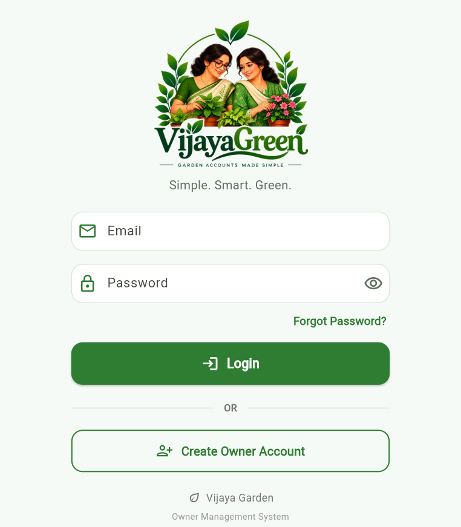
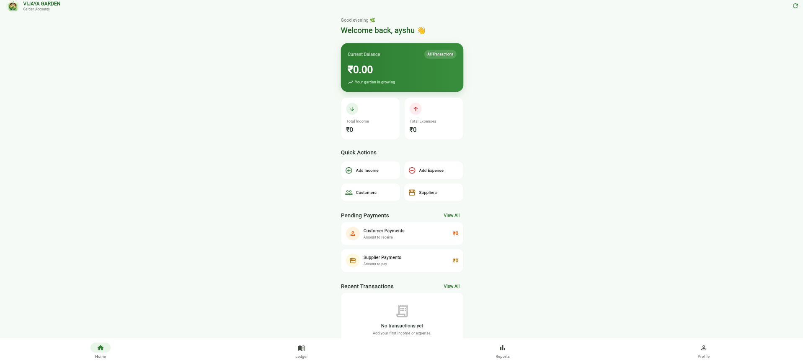
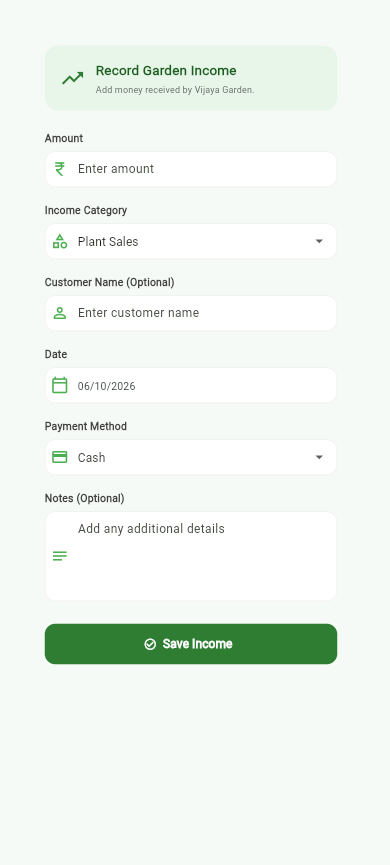
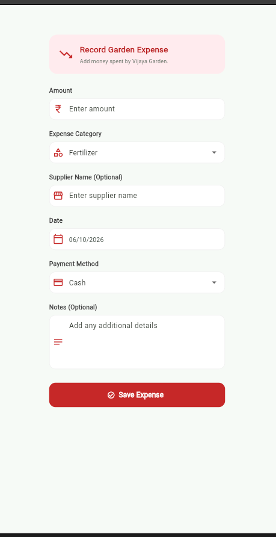
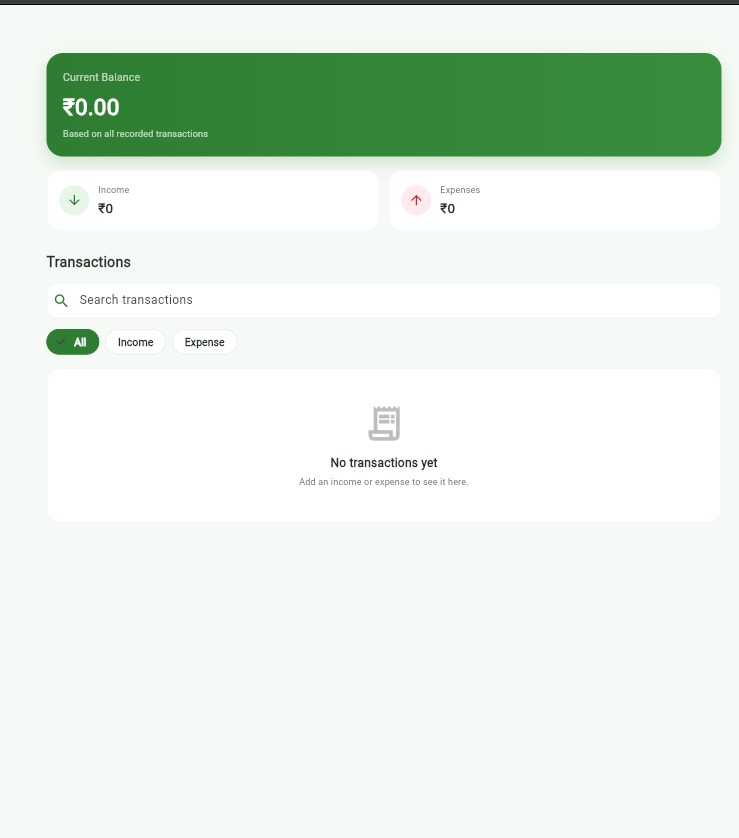
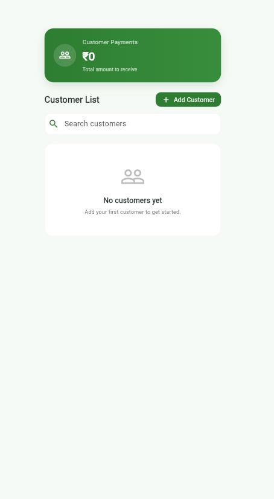
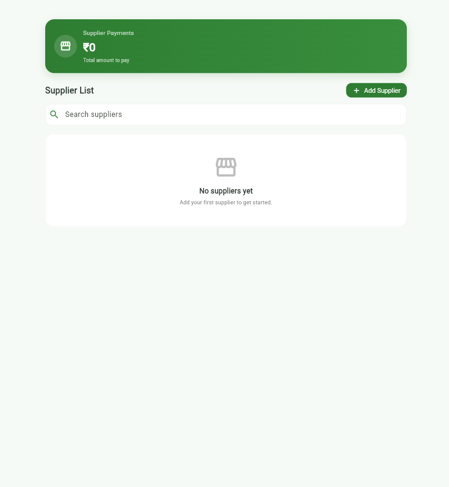
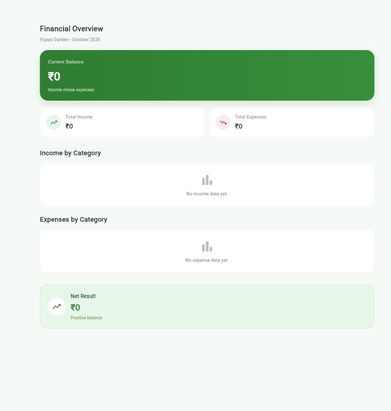
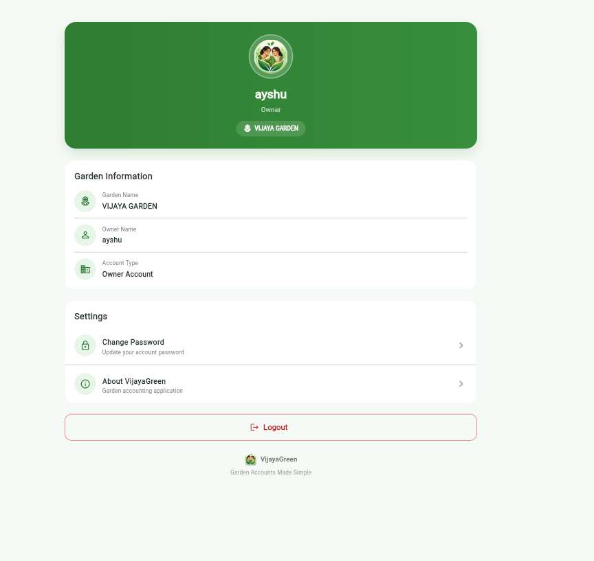

<div align="center">

# 🌿 VijayaGreen

### *From the garden to the ledger.*

A simple, owner-focused accounting application for **Vijaya Garden**, a family-owned garden and nursery business.


🌱 **Plant it** &nbsp;•&nbsp; 💧 **Record it** &nbsp;•&nbsp; 🌳 **Watch it grow**

</div>

---

## 📖 About

**VijayaGreen** is a simple accounting application created for **Vijaya Garden**, a family-owned garden and nursery business.

The application provides one place to manage daily financial records, including income, expenses, customer receivables, supplier payables, transactions, and financial reports.

VijayaGreen is designed to keep everyday business record-keeping simple and easy to manage.

---

## 🏡 Designed for Vijaya Garden

VijayaGreen is built around the day-to-day requirements of a garden and nursery business.

The application helps the owner:

- 🌼 Record income and sales
- 💰 Track business expenses
- 👥 Manage customer records and receivables
- 🚚 Manage supplier records and payables
- 📒 Review financial transactions
- 📊 Monitor the overall financial position

The goal is simple:

> **Record the day, check the numbers, and keep the business organized.**

---

## ✨ Features

### 🔐 Owner Account

- Owner login
- Create owner account
- Owner profile
- Logout

### 💰 Income Management

- Add income transactions
- Select income category
- Enter transaction amount
- Add customer or party name
- Add notes or description
- Select payment method
- Select transaction date

### 💸 Expense Management

- Add expense transactions
- Select expense category
- Enter transaction amount
- Add supplier or party name
- Add notes or description
- Select payment method
- Select transaction date

### 📒 Ledger

- View income and expense transactions
- Search transactions
- Filter transactions
- View transaction details
- View total income
- View total expenses
- View current balance

### 👥 Customer Management

- Add customers
- Store customer phone numbers
- Record amounts to receive
- View customer details
- Edit customer records
- Delete customer records
- Search customers
- View total receivables

### 🚚 Supplier Management

- Add suppliers
- Store supplier phone numbers
- Record supply categories
- Record amounts to pay
- View supplier details
- Edit supplier records
- Delete supplier records
- Search suppliers
- View total payables

### 📊 Reports

- Current balance
- Total income
- Total expenses
- Income categories
- Expense categories
- Net result
- Monthly reporting information

### 👤 Profile

- Owner information
- Garden information
- Account type
- About VijayaGreen
- Logout

---

## 📱 Application Screens

## 📸 Screenshots

### 🔐 Login



### 🏡 Dashboard



### 💰 Income



### 💸 Expense



### 📒 Ledger



### 👥 Customers



### 🚚 Suppliers



### 📊 Reports



### 👤 Profile



---

## 🗄️ Data Management

VijayaGreen uses a local **SQLite database** to store business records.

The database currently manages:

- Financial transactions
- Customer records
- Supplier records

### Transaction Information

Transactions can contain:

- Transaction type
- Category
- Amount
- Date
- Customer or supplier name
- Description
- Payment method

### Customer Information

Customer records include:

- Customer name
- Phone number
- Amount to receive

### Supplier Information

Supplier records include:

- Supplier name
- Phone number
- Supply category
- Amount to pay

The application stores this information locally, allowing previously recorded data to remain available after logging out and logging in again.

---

## 🛠️ Technology Stack

| Technology | Purpose |
|---|---|
| **Flutter** | Application framework |
| **Dart** | Programming language |
| **SQLite** | Local database |
| **sqflite** | SQLite database integration |
| **path** | Database path management |
| **Material Design** | User interface components |

---

## 📂 Project Structure

```text
VijayaGreen/
│
├── assets/
│   └── images/
│       ├── vijayagreen_logo.png
│       └── vijayagreen_icon.png
│
├── lib/
│   ├── main.dart
│   │
│   ├── database/
│   │   └── database_helper.dart
│   │
│   └── screens/
│       ├── login_screen.dart
│       ├── create_account_screen.dart
│       ├── dashboard_screen.dart
│       ├── income_screen.dart
│       ├── expense_screen.dart
│       ├── ledger_screen.dart
│       ├── customers_screen.dart
│       ├── suppliers_screen.dart
│       ├── reports_screen.dart
│       └── profile_screen.dart
│
├── pubspec.yaml
└── README.md
```

---

## 🚀 Getting Started

### Prerequisites

Make sure you have the following installed:

- Flutter
- Dart SDK
- Visual Studio Code or Android Studio
- A supported Flutter development environment

Check your Flutter installation:

```bash
flutter doctor
```

### Clone the Repository

```bash
git clone https://github.com/aishwar-ya/VijayaGreen.git
```

### Navigate to the Project

```bash
cd VijayaGreen
```

### Install Dependencies

```bash
flutter pub get
```

### Run the Application

```bash
flutter run
```

To run the application on Windows:

```bash
flutter run -d windows
```

---

## 💻 Requirements

VijayaGreen requires:

- Flutter SDK
- Dart SDK
- A supported Flutter development platform
- SQLite support through the `sqflite` package

---

## 🔐 Data & Privacy

VijayaGreen is designed primarily for the internal use of Vijaya Garden.

Business records are stored locally using SQLite.

The public GitHub repository should not contain:

- Passwords
- Private contact information
- Personal financial information
- API keys
- Other confidential business information

The current version is designed as a local, owner-focused accounting application.

---

## 🌱 Future Enhancements

Possible future improvements include:

- ☁️ Cloud backup and synchronization
- 📄 PDF report generation
- 📊 Advanced financial analytics
- 📥 Excel or CSV export
- 👥 Multiple staff accounts
- 🔔 Payment reminders
- 💾 Database backup and restore

> These are potential future enhancements and are not part of the current implementation.

---

## 👤 User Role

VijayaGreen is currently designed primarily for the owner of Vijaya Garden.

The application keeps the interface simple so that daily income, expenses, customers, suppliers, and financial reports can be managed without complicated accounting workflows.

---

## 🌿 Why VijayaGreen?

A garden business grows through many small daily activities.

A plant is sold.
A supplier is paid.
A customer has a pending payment.
A new expense is recorded.

VijayaGreen brings these everyday records together in one simple application.

*From the garden to the ledger.*

---

## 📄 License

This project is developed for Vijaya Garden and is not currently distributed under an open-source license.

---

<div align="center">

🌱 **VijayaGreen**
Built for Vijaya Garden.
*From the garden to the ledger.*

</div>